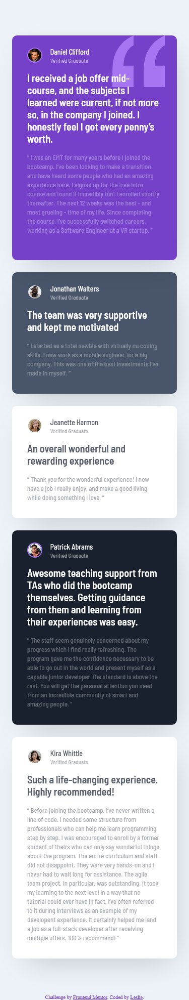
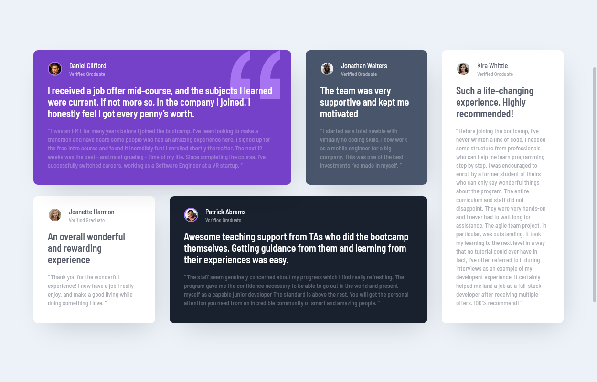

# Frontend Mentor - Testimonials grid section solution

This is a solution to the [Testimonials grid section challenge on Frontend Mentor](https://www.frontendmentor.io/challenges/testimonials-grid-section-Nnw6J7Un7). Frontend Mentor challenges help you improve your coding skills by building realistic projects. 

## Table of contents

- [Overview](#overview)
  - [The challenge](#the-challenge)
  - [Screenshot](#screenshot)
- [My process](#my-process)
  - [Built with](#built-with)
  - [What I learned](#what-i-learned)
  - [Continued development](#continued-development)
- [Author](#author)

## Overview

### The challenge

Users should be able to:

- View the optimal layout for the site depending on their device's screen size

### Screenshot

## My process

### Built with

- Semantic HTML5 markup
- CSS custom properties
- Flexbox
- CSS Grid
- Mobile-first workflow

### What I learned

Flexbox and Grid are really powerful tools to make the layout of a project. Originally, I used the position property when setting the media queries, because I was having a hard time with Grid. After a good night sleep a decided to give it a try again and I'm really happy how it turned out.

### Continued development

I'm not entirely convinced with the sizes of some of the cards on the media queries, I'm going to check out some designs to see how I can improve it.

## Author

- Website - [Leslie Fernandez](https://github.com/leslief10)

